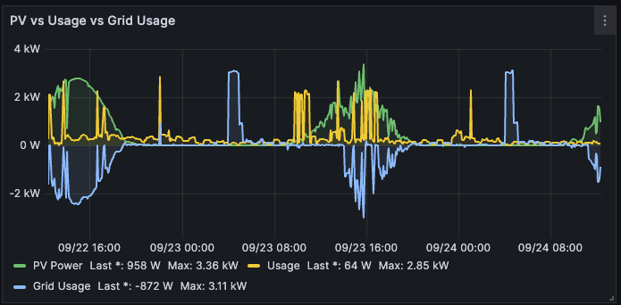
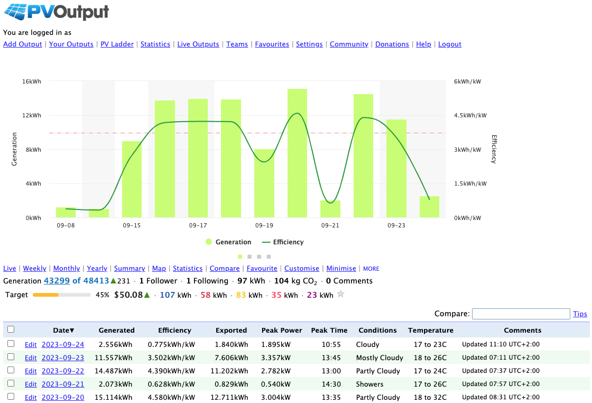

# livoltek-stats-parse
Parses the stats produced by the livoltek hyper-5000 solar inverter using python3.
Pushes to influxdb (for grafana) and pvoutput.

# Links
- https://pvoutput.org/help/api_specification.html#api-add-batch-status-data-structure
- https://evs.livoltek-portal.com/

# How to use
1. Download the most specific device file (url eg. https://evs.livoltek-portal.com/#/customer/tocDevice/1234/3212/123/12/12/0)
2. Rename `template.config.ini` to `config.ini` and fill it out
3. Install requirements with `make deps`
4. Run main using `python main.py` or `./main.py`

# Screenshots

